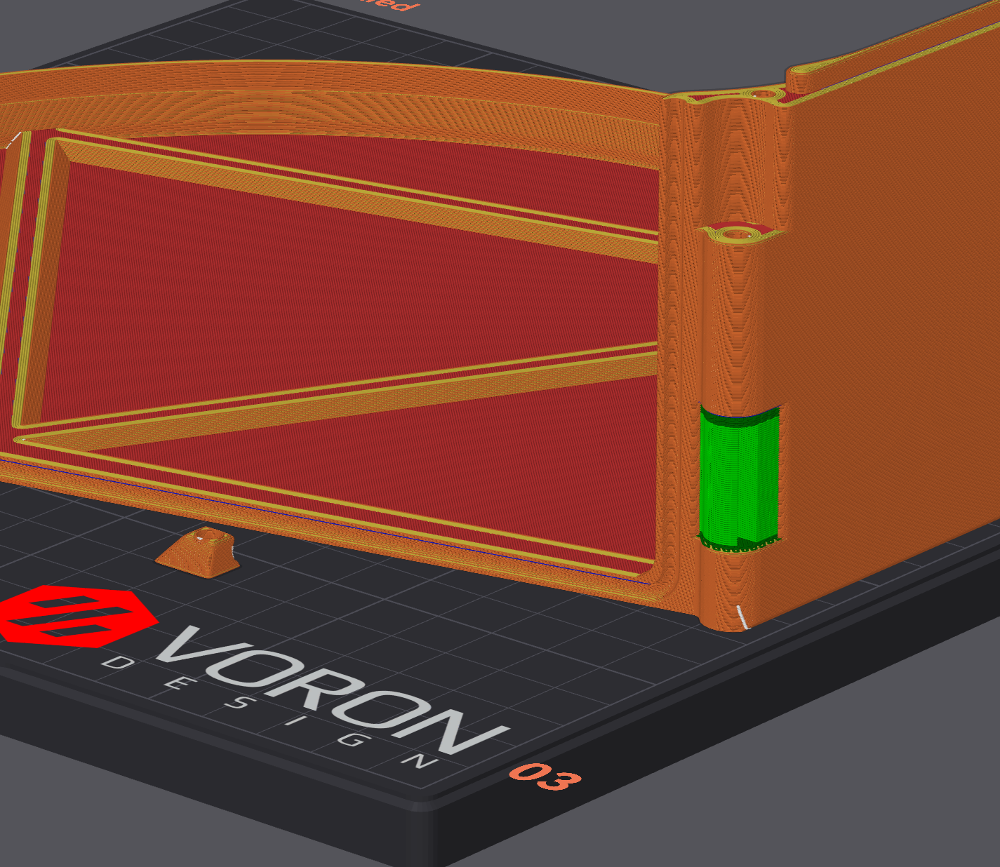

# EMU — 250 mm Build Plate Mod

### Dry box lid with a separate screw-on latch

A simple modification that allows the EMU dry box lid to be printed on a **250 mm build plate**. The integrated catch is removed from the lid and replaced with a separate printed latch, secured with an M2 screw and heat-set insert.

---

## Overview

The mod consists of two printed parts: a modified lid and a matching latch. Print both files below in place of the standard lid with its integrated catch.

### Modified lid

The lid has the integrated catch removed and includes mounting features for the separate latch.

  

### Separate latch

The replacement latch attaches to the modified lid using the hardware listed below.

  

## Printed Parts

| Qty | Part | STL file |
| :---: | --- | --- |
| 1 | Modified dry box lid | [250mm_adjusted_Lid.stl](250mm_adjusted_Lid.stl) |
| 1 | Separate latch | [250mm_adjusted_Latch.stl](250mm_adjusted_Latch.stl) |

> [!TIP]
> Check the lid's orientation and total footprint in your slicer before printing. Allow room for any brim or skirt within your printer's usable build area.

## Bill of Materials

Additional hardware required **per lid**:

| Qty | Item |
| :---: | --- |
| 1 | M2 heat-set insert |
| 1 | M2 × 6 mm screw |

## Assembly

1. Print the modified lid and separate latch.
2. Install the M2 heat-set insert in the provided insert pocket and allow it to cool.
3. Align the latch with the mounting features on the lid.
4. Secure the latch with the M2 × 6 mm screw. Tighten until secure, taking care not to overtighten into the printed parts.
5. Check that the lid closes and the latch engages correctly before use.

## Print settings

To get a clean print these settings worked well repeatedly for me

In Orca, YMMV for other slicers
1. Enable Support: Yes
2. Supports / Type: Normal (manual), paint supports on the overhang on the hinge latch that would otherwise be unsupported
3. Supports / Style: Snug
4. Supports / Base Pattern: Default
5. Supports / Top Interface Layers: 3
6. Supports / Top Interface spacing: 0.25mm
7. Supports / Bottom Interface spacing: 0.3mm

  

---

[← Back to EMU](../../README.md)
